# 🌟 **KPI Anomaly Detection & Automated Root-Cause Analysis (RCA) System**

### *Enterprise Analytics Platform — Streamlit • Prophet • Isolation Forest • Automated Reporting Engine (V4)*

---

<div align="center">
  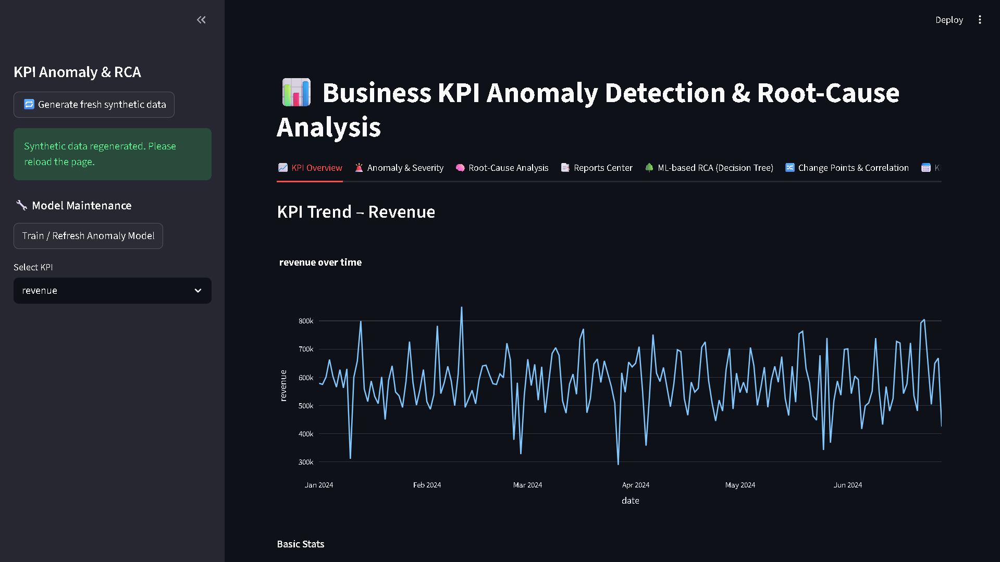
  <br>
  <i>End-to-End KPI Intelligence System with Anomaly Detection, RCA & Reporting</i>
</div>

---

# 🖼️ **Project Overview**

This repository contains a **Google-grade enterprise analytics system** that monitors business KPIs, detects anomalies, performs automated root-cause analysis, and generates full **executive-ready MD + PDF reports**.

Built exactly like dashboards used at:

**Google • Uber • Amazon • Swiggy • Flipkart • Meesho • Meta • Netflix**

It includes:

* 🔮 **Hybrid anomaly detection (Prophet + IsolationForest + Z-Score)**
* 🧠 **RCA engine (channel / region / cohort contributions)**
* 📑 **Full reporting engine (MD, PDF, ZIP)**
* 📉 **Change-point detection**
* 📅 **Forecasting (7–60 days)**
* 🎞 **Anomaly replay**
* 🤖 **AutoML model comparison**
* 🎛 **What-if simulator**
* 🌳 **ML-based RCA (Decision Tree)**
* 🧭 **13-tab enterprise Streamlit interface**

---

# 🏷️ **Badges**


---

## ⭐ 1. **KPI Overview Dashboard**

<div align="center">
  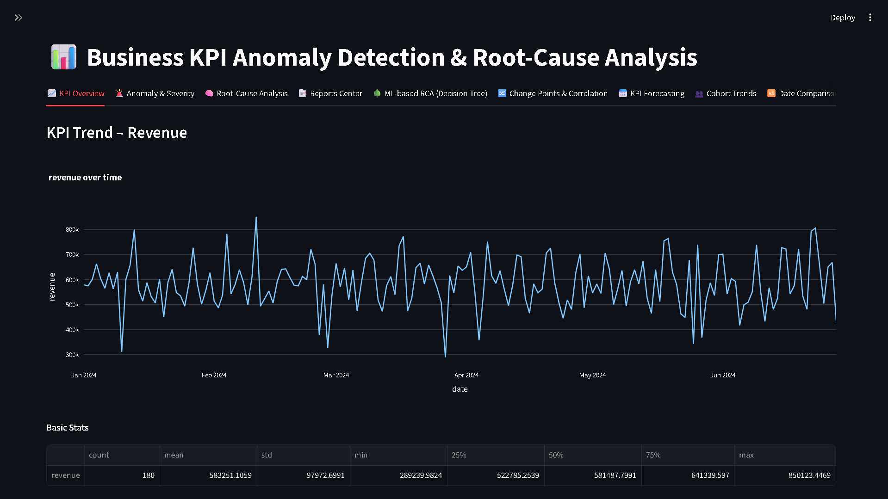
</div>

---

## ⭐ 2. **Anomaly Detection & Severity Levels**

<div align="center">
  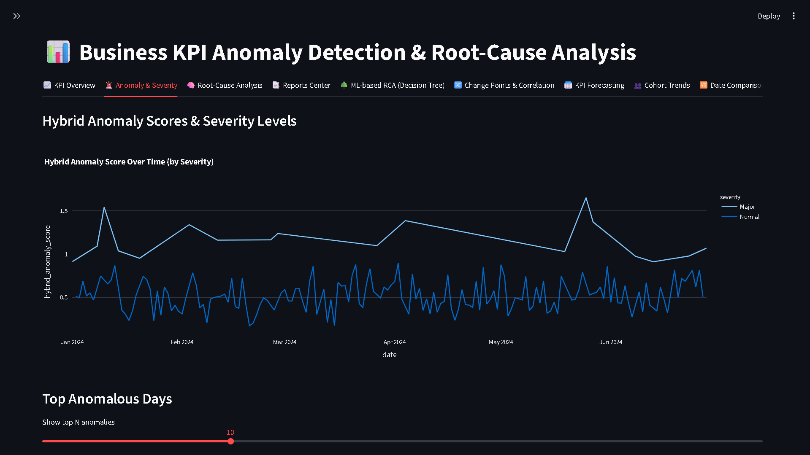
</div>

---

## ⭐ 3. **Root-Cause Analysis (RCA)**

<div align="center">
  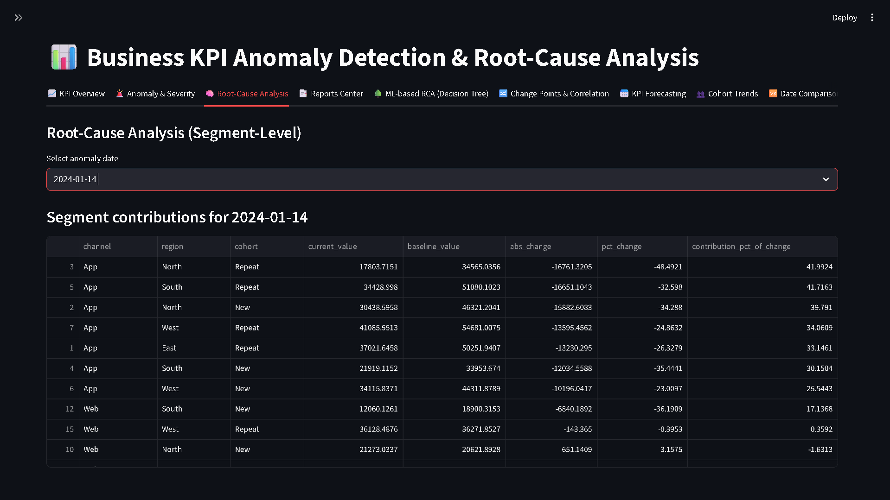
</div>

---

## ⭐ 4. **Reports Center (MD + PDF + ZIP)**

<div align="center">
  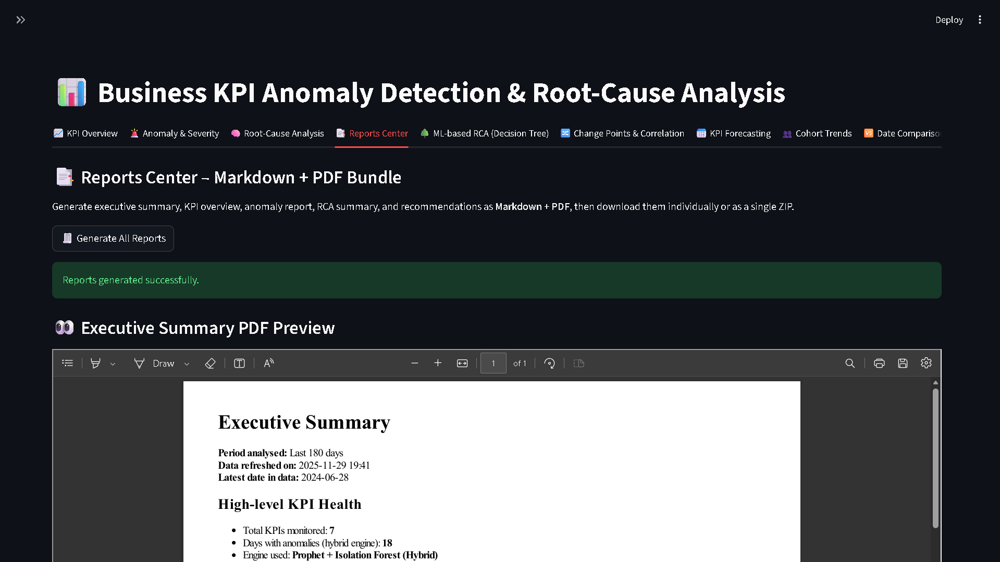
</div>

---

## ⭐ 5. **ML-Based RCA (Decision Tree)**

<div align="center">
  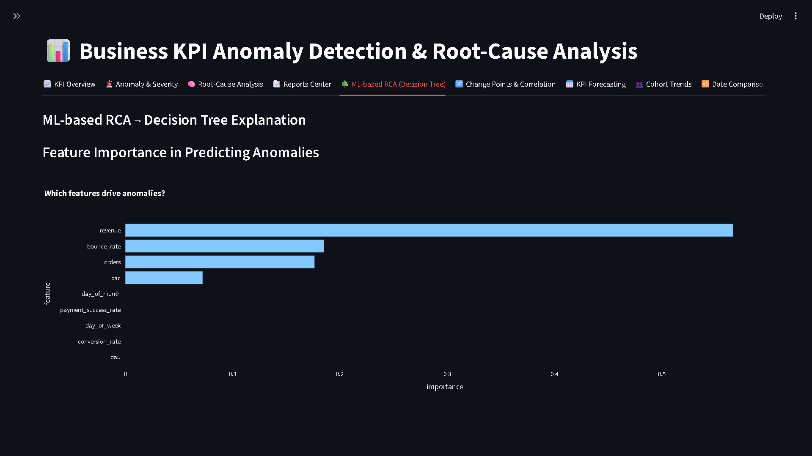
</div>

---

## ⭐ 6. **Change Point Detection & Correlation Matrix**

<table>
<tr>
<td>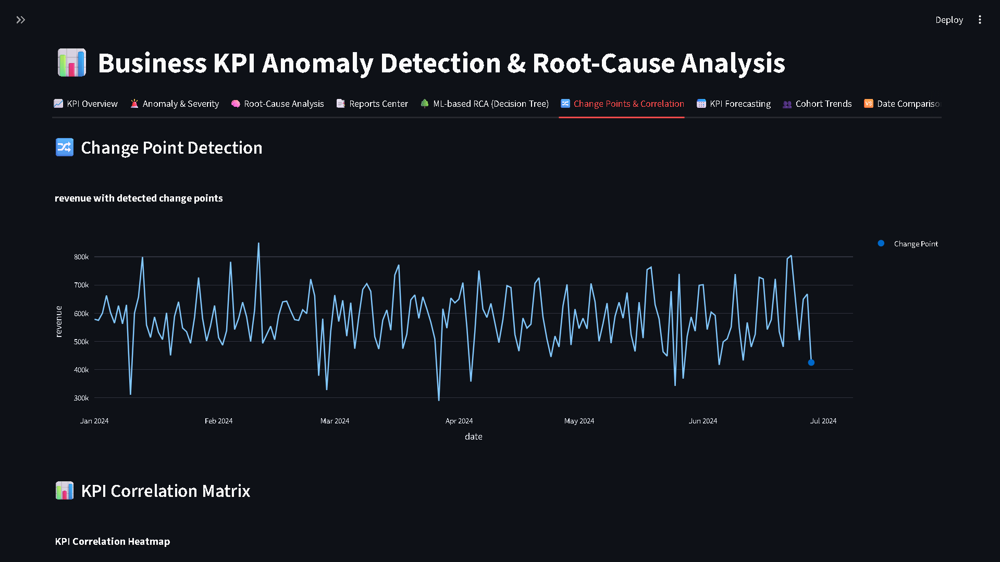</td>
<td></td>
</tr>
</table>

---

## ⭐ 7. **KPI Forecasting (Prophet)**

<div align="center">
  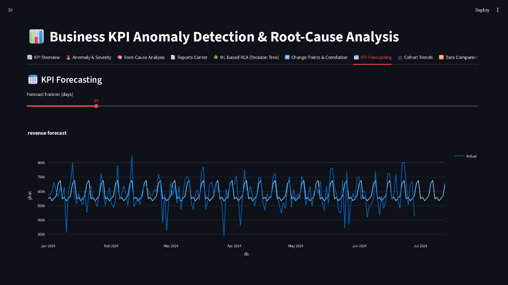
</div>

---

## ⭐ 8. **Cohort / Channel / Region Trends**

<div align="center">
  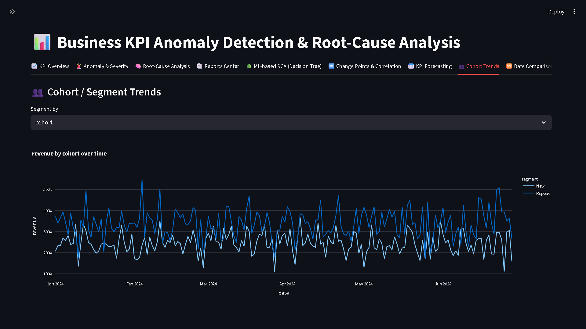
</div>

---

## ⭐ 9. **Date Comparison Engine**

<div align="center">
  
</div>

---

## ⭐ 10. **What-If Simulator**

<div align="center">
  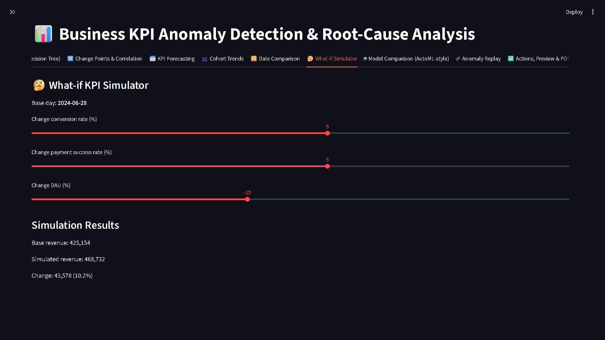
</div>

---

## ⭐ 11. **AutoML Model Comparison**

<div align="center">
  
</div>

---

## ⭐ 12. **Anomaly Replay Timeline**

<div align="center">
  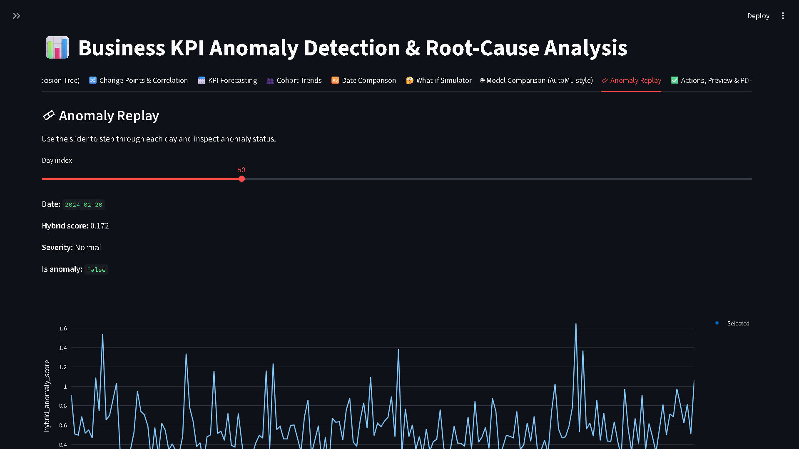
</div>

---

## ⭐ 13. **Actions + PDF Export**

<div align="center">
  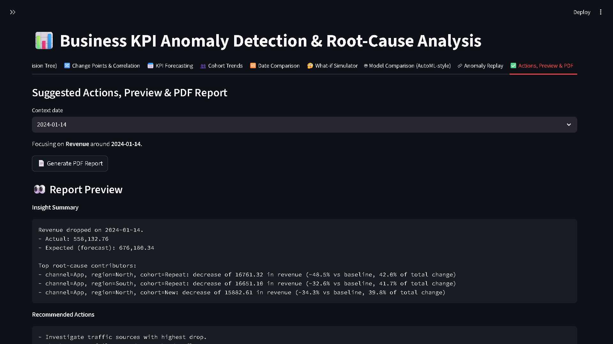
</div>

---

# 🧬 **System Architecture**

```
 Raw KPIs → Preprocessing → Hybrid Anomaly Engine
              ↓                 ↓
     RCA Engine (channel/region/cohort)
              ↓
   Streamlit 12–Tab Dashboard
              ↓
      Reporting Engine (MD + PDF + ZIP)
```

---

# 🧭 **Dashboard Overview (13 Tabs)**

1️⃣ **📈 KPI Overview**
2️⃣ **🚨 Anomaly Detection & Severity**
3️⃣ **🧠 Root-Cause Analysis**
4️⃣ **📑 Reports Center (PDF + MD + ZIP + Preview)**
5️⃣ **🌳 ML-Based RCA (Decision Tree)**
6️⃣ **🔀 Change Points & Correlation**
7️⃣ **📅 KPI Forecasting**
8️⃣ **👥 Cohort Trends**
9️⃣ **🆚 Date Comparison**
🔟 **🤔 What-If Simulator**
1️⃣1️⃣ **🤖 Model Comparison (AutoML Style)**
1️⃣2️⃣ **🎞 Anomaly Replay**
1️⃣3️⃣ **✅ Actions + PDF Generator**

---

# 📁 **Folder Structure**

```
Enterprise-KPI-Anomaly-RCA-System/
│
├── app/
│   ├── anomaly_engine.py
│   ├── config.py
│   ├── dashboard.py
│   ├── data_generator.py
│   ├── generate_reports.py
│   ├── insights_engine.py
│   ├── model_registry.py
│   ├── pdf_generator.py
│   ├── rca_engine.py
│   └── train_models.py
│
│
├── data/
│   ├── anomalies/
│   ├── processed/
│   └── raw/
│
│
├── models/
│
├── reports/
│   ├── business_overview.md
│   ├── business_overview.pdf
│   ├── clv_summary.md
│   ├── clv_summary.pdf
│   ├── executive_summary.md
│   ├── executive_summary.pdf
│   ├── frm_report.md
│   ├── frm_report.pdf
│   ├── persona_insights.md
│   ├── persona_insights.pdf
│   └── reports_bundle.zip
│
├── screenshots/
│
├── tests/
│   ├── conftest.py
│   ├── test_anomaly_engine.py
│   ├── test_data_generator.py
│   └── test_rca_engine.py
│
├── requirements.txt
└── README.md
```

---

# ⚙️ **Installation**


### 1️⃣ Clone

```bash
git clone https://github.com/girishshenoy16/Enterprise-KPI-Anomaly-RCA-System
cd Enterprise-KPI-Anomaly-RCA-System
```

## 2️⃣ Create Virtual Environment

```bash
python -m venv venv
venv\Scripts\activate
```

## 3️⃣ Install Dependencies

```bash
python.exe -m pip install --upgrade pip
pip install -r requirements.txt
```

---

# ▶️ **Running the Entire Project (Everything Happens Inside Streamlit)**

Once you start the app, **Streamlit handles the entire workflow end-to-end**.

### **Step 1 — Launch the app**

```bash
streamlit run app/dashboard.py
```

---

# 🧰 **Inside Streamlit — Your Entire Workflow**

### ✔ **1. Generate Synthetic Data**

Inside the **Sidebar**, click:

**➡️ “Generate Synthetic KPI Data”**

> ## **After Doing This Step, Reload The Page**

* Creates raw + processed data
* Automatically refreshes KPI files
* No manual CSV handling needed

> ## **Refer to the image below as reference**


<div align="center">
  
  <br>
</div>


---

### ✔ **2. Train / Refresh Anomaly Model**

Still in the sidebar, click:

**➡️ “Train / Refresh Anomaly Model”**

* Trains Isolation Forest
* Saves model to `/models/isolation_forest.pkl`
* Ensures anomaly engine works instantly

> ## **Refer to the image below as reference**


<div align="center">
  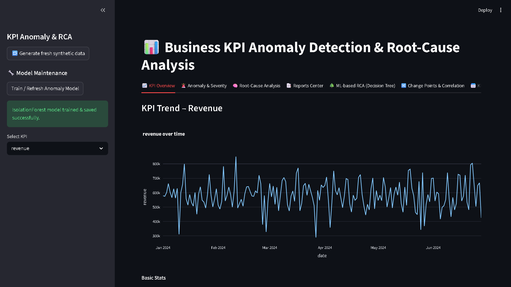
  <br>
</div>


---

### ✔ **3. Explore the Dashboard (All 13 Tabs)**

You can now explore:

* KPI Overview
* Anomaly Detection
* Severity Ladder
* Change Points
* RCA
* Forecasting
* Cohorts
* AutoML comparison
* What-if simulation
* Anomaly Replay
* Date Comparison
* PDF / Actions

---

### ✔ **4. Generate All Reports (Markdown + PDF + ZIP)**

In the **Reports Center** tab:

Click:

**➡️ “Generate All Reports”**

Streamlit automatically:

* Creates Markdown reports
* Converts them into PDFs via **wkhtmltopdf**
* Bundles them into a ZIP
* Shows **inline PDF preview**
* Offers **Download PDF** + **Download ZIP**

No command-line steps required. Zero manual preprocessing.

---

# 🧩 Final Workflow Summary (Exactly What Recruiters Love)

| Step | Where       | Action                      |
| ---- | ----------- | --------------------------- |
| 1    | Sidebar     | Generate Synthetic Data     |
| 2    | Sidebar     | Train/Refresh Anomaly Model |
| 3    | Main UI     | Explore 13 Feature Tabs     |
| 4    | Reports Tab | Generate MD + PDF + ZIP     |
| 5    | Reports Tab | Preview & Download Reports  |


---

# 🧪 **Testing**

```bash
pytest -q
```

---

# 🧠 **Future Work**

* Slack/Teams alerting
* Real-time stream ingestion
* LSTM/Transformer anomaly models
* Causal inference