# 🌟 Enterprise KPI Anomaly Detection & Root-Cause Analysis System

### Enterprise Analytics Platform • Streamlit • Prophet • Isolation Forest • Automated Reporting Engine

### End-to-End KPI Intelligence System with Anomaly Detection, RCA & Reporting
---

<div align="center">

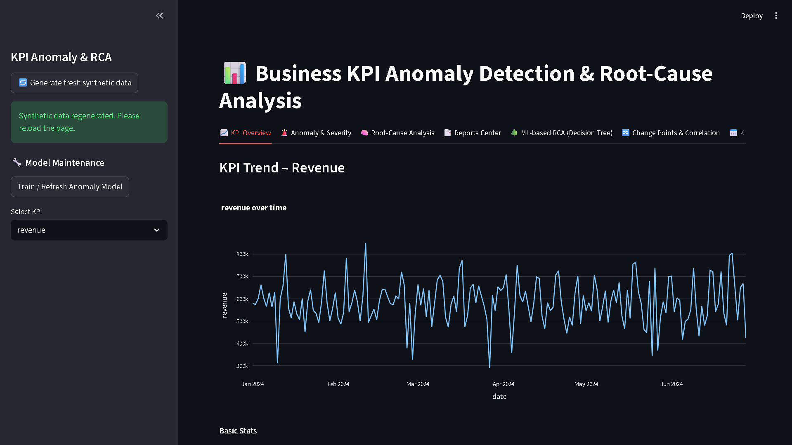

<br/><br/>


</div>

---

# 🖼️ Project Overview

An enterprise-grade KPI intelligence platform designed to monitor business metrics, detect anomalies, 
perform automated root-cause analysis (RCA), generate executive-ready reports, and support proactive 
business decision-making.

The platform combines:
- Hybrid anomaly detection
- KPI forecasting
- Automated RCA
- Executive dashboarding
- AutoML model comparison
- What-if business simulation
- PDF & Markdown reporting workflows

Built with a modular analytics architecture using:
- Streamlit
- Prophet
- Isolation Forest
- Decision Trees
- Automated reporting pipelines

---

# 🚀 Key Business Capabilities

- Real-time KPI monitoring
- Hybrid anomaly detection
- Automated root-cause analysis
- Executive-ready reporting engine
- Forecasting & trend intelligence
- What-if business simulation
- AutoML model comparison
- Change-point detection
- Cohort & regional intelligence
- Interactive enterprise dashboard workflows

---

# 📈 Business Impact

This system helps organizations:

- Detect KPI anomalies proactively
- Reduce manual RCA investigation time
- Improve executive decision-making
- Forecast KPI trends & operational shifts
- Monitor business health in real-time
- Automate reporting workflows
- Improve operational visibility
- Enable analytics-driven strategic planning

---

# 🧭 13-Tab Enterprise Dashboard

| Module                    | Function                              |
|---------------------------|---------------------------------------|
| 📈 KPI Overview           | Business KPI monitoring               |
| 🚨 Anomaly Detection      | Outlier & severity identification     |
| 🧠 Root-Cause Analysis    | Channel / region / cohort diagnostics |
| 📑 Reports Center         | PDF + MD + ZIP report generation      |
| 🌳 ML-Based RCA           | Decision-tree-based RCA engine        |
| 🔀 Change Point Detection | Trend shift analysis                  |
| 📅 Forecasting            | Prophet-based KPI forecasting         |
| 👥 Cohort Trends          | Cohort & segment analysis             |
| 🆚 Date Comparison        | Period-over-period comparison         |
| 🤔 What-If Simulator      | KPI impact simulation                 |
| 🤖 AutoML Comparison      | Model performance benchmarking        |
| 🎞 Anomaly Replay         | Historical anomaly playback           |
| ✅ Actions & Exports       | PDF generation & action workflows     |

---

# 📸 Platform Screenshots

## ⭐ **KPI Overview Dashboard**

<div align="center">
  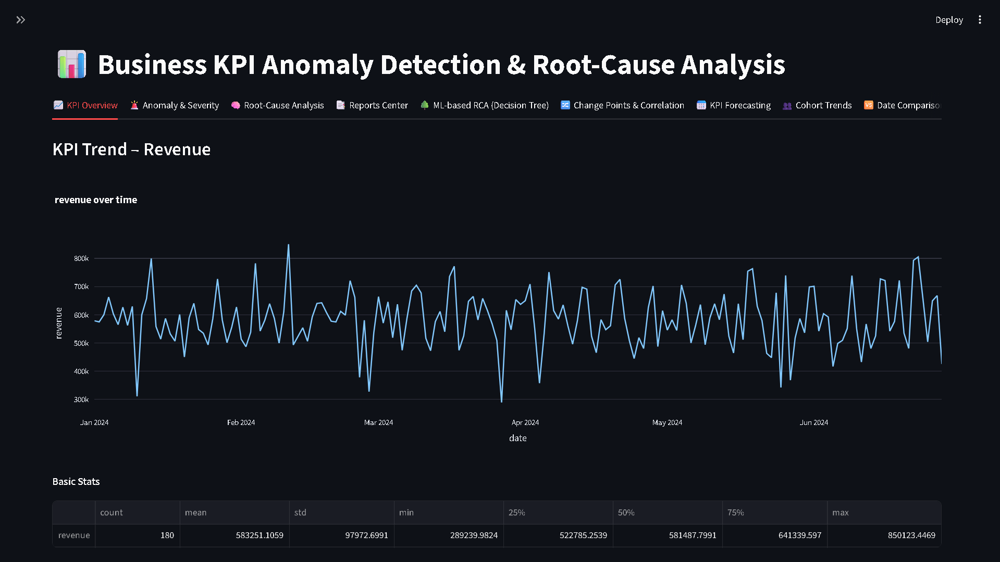
</div>

---

## ⭐ **Anomaly Detection & Severity Analysis**

<div align="center">
  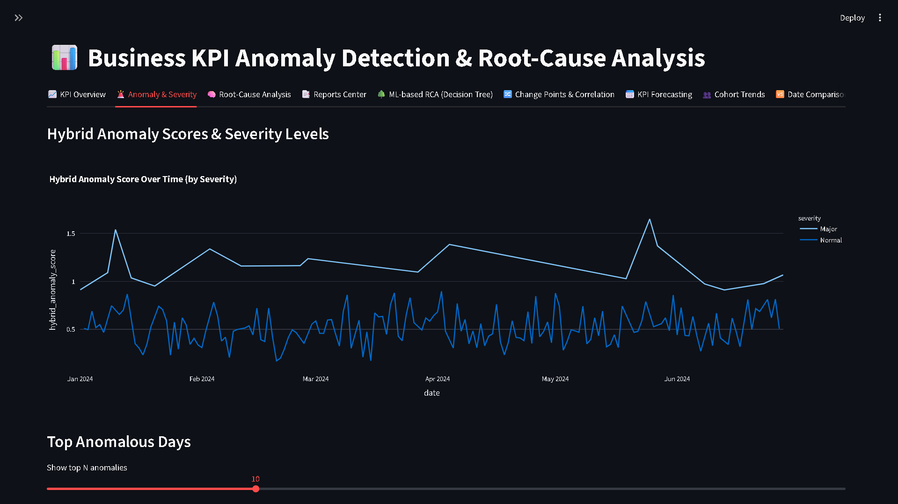
</div>

---

## ⭐ **Root-Cause Analysis (RCA) Engine**

<div align="center">
  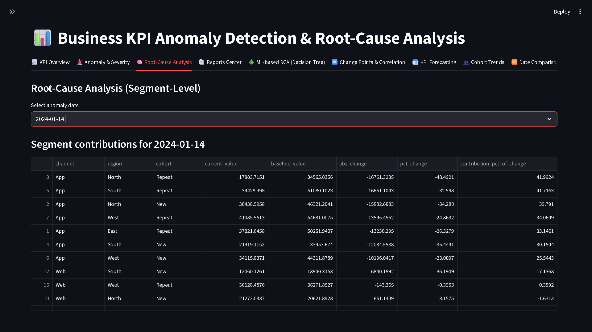
</div>

---

## ⭐ **KPI Forecasting System**

<div align="center">
  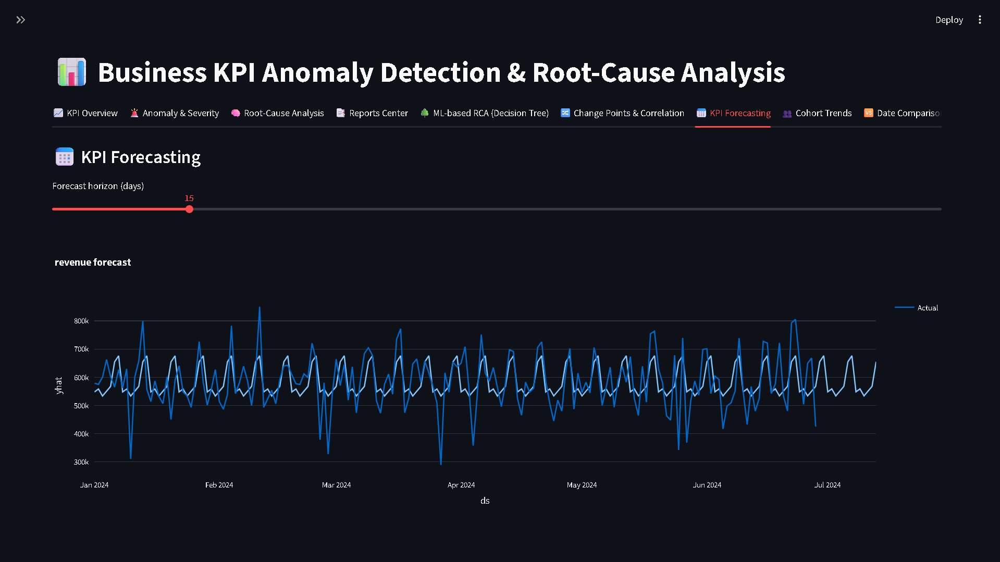
</div>

---

# 📸 Additional Dashboard Screenshots

<details>

<summary>View Additional Dashboard Screens</summary>

<br/>

## ⭐ **Reports Center**

<div align="center">
  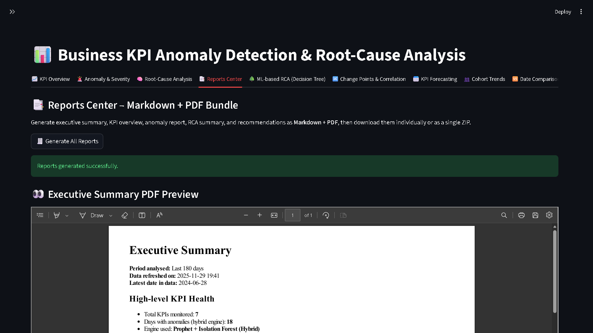
</div>

---

## ⭐ **ML-Based RCA (Decision Tree)**

<div align="center">
  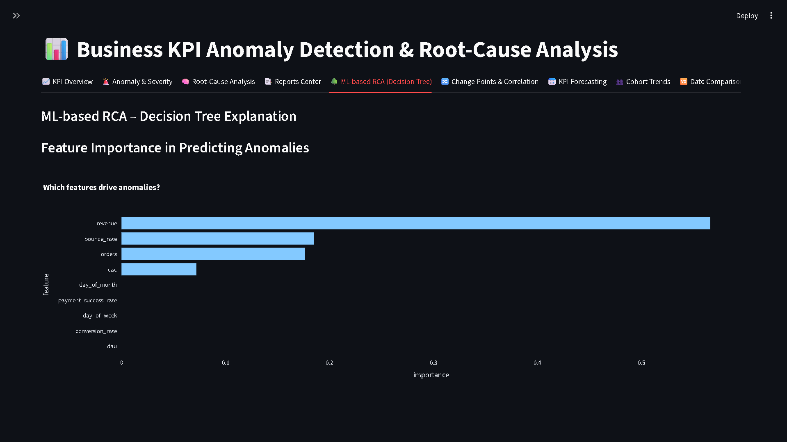
</div>

---

## ⭐ **Change Point Detection & Correlation Matrix**

<table>
    <tr>
        <td>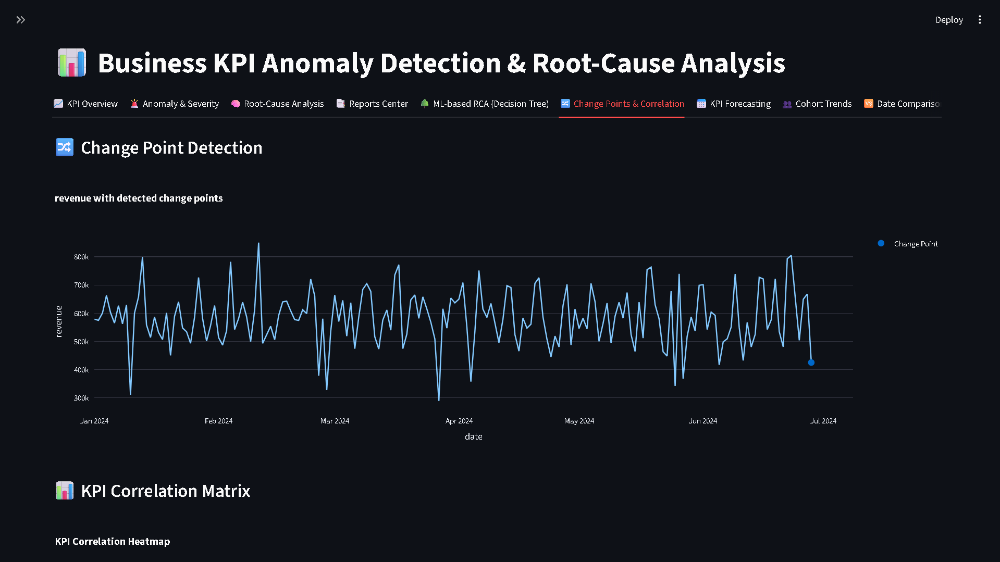</td>
        <td></td>
    </tr>
</table>

---

## ⭐ **Cohort / Channel / Region Trends**

<div align="center">
  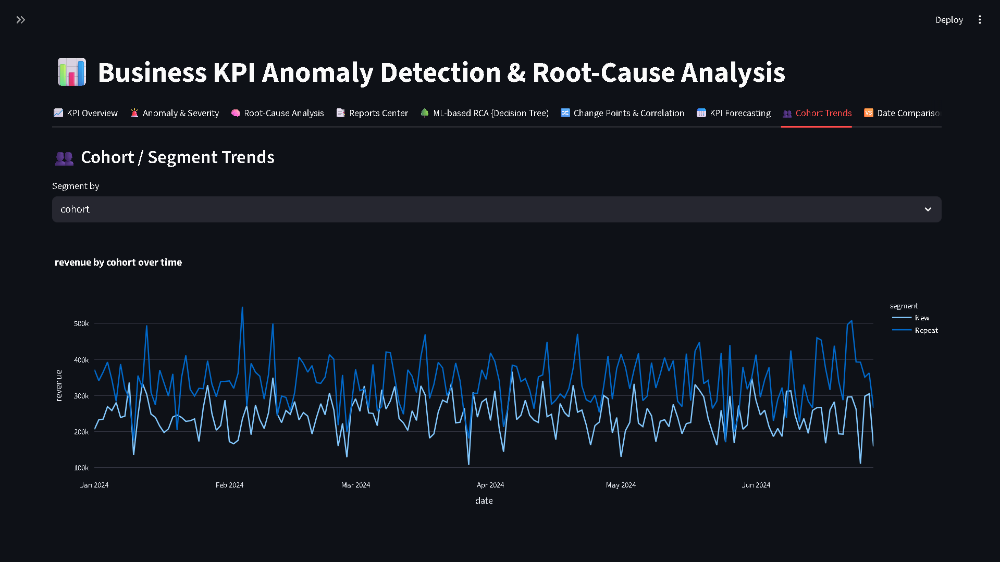
</div>

---

## ⭐ **Date Comparison Engine**

<div align="center">
  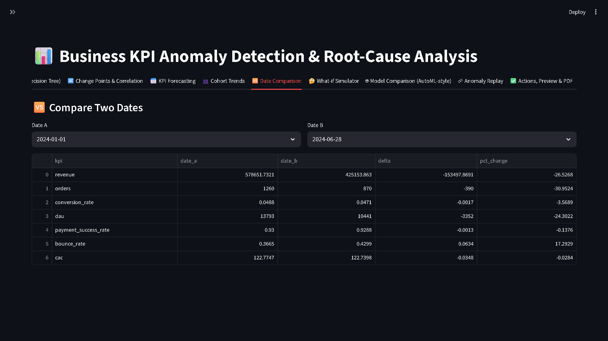
</div>

---

## ⭐ **What-If Simulator**

<div align="center">
  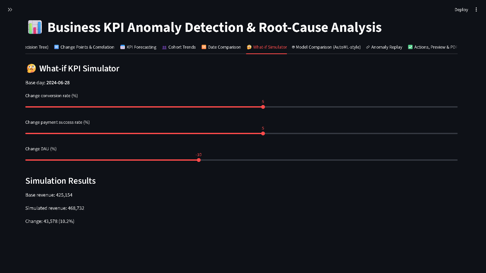
</div>

---

## ⭐ **AutoML Model Comparison**

<div align="center">
  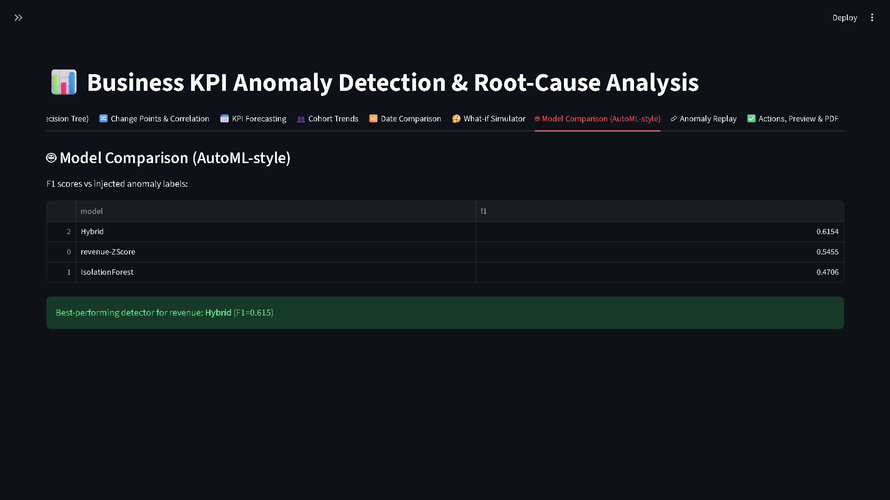
</div>

---

## ⭐ **Anomaly Replay Timeline**

<div align="center">
  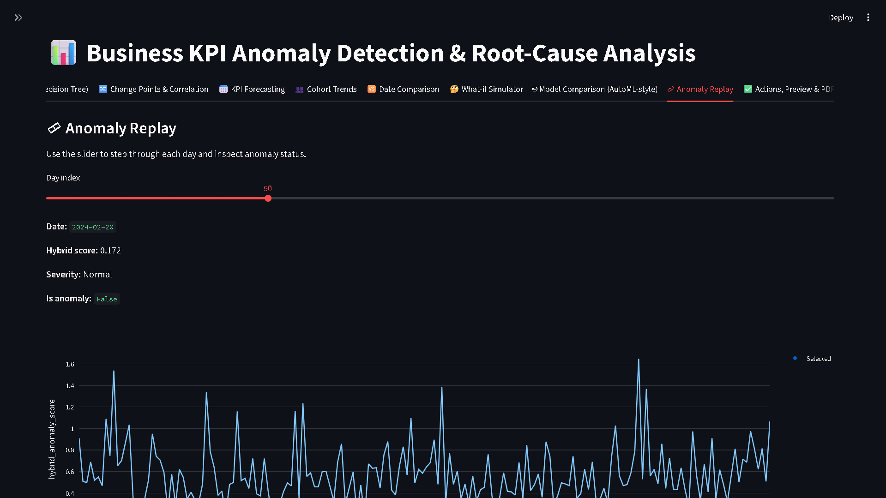
</div>

---

## ⭐ **Actions + PDF Export**

<div align="center">
  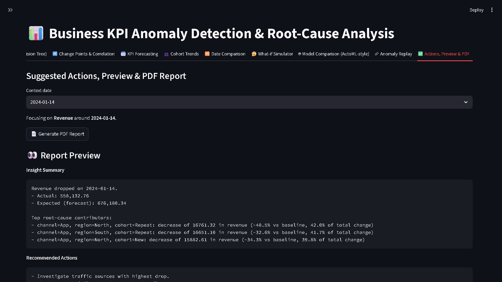
</div>

</details>

---

# 🧬 **System Architecture**

```text
Raw KPI Data
      ↓
Preprocessing Pipeline
      ↓
Hybrid Anomaly Detection Engine
(Prophet + Isolation Forest + Z-Score)
      ↓
Root-Cause Analysis Engine
(Channel / Region / Cohort Analysis)
      ↓
Forecasting & Simulation Modules
      ↓
13-Tab Enterprise Streamlit Dashboard
      ↓
Automated Reporting Engine
(MD + PDF + ZIP)
```

---

# ⚙️ Tech Stack

| Category        | Technologies                    |
| --------------- | ------------------------------- |
| Frontend        | Streamlit                       |
| Forecasting     | Prophet                         |
| ML Models       | Isolation Forest, Decision Tree |
| Visualization   | Plotly, Matplotlib              |
| Reporting       | pdfkit                          |
| Data Processing | Pandas, NumPy                   |
| Testing         | Pytest                          |

---

# 📁 **Project Structure**

```
Enterprise-KPI-Anomaly-RCA-System/
│
├── app/
│   ├── anomaly_engine.py
│   ├── config.py
│   ├── dashboard.py
│   ├── data_generator.py
│   ├── generate_reports.py
│   ├── insights_engine.py
│   ├── model_registry.py
│   ├── pdf_generator.py
│   ├── rca_engine.py
│   └── train_models.py
│
│
├── data/
│   ├── anomalies/
│   ├── processed/
│   └── raw/
│
│
├── models/
│
├── reports/
│   ├── business_overview.md
│   ├── business_overview.pdf
│   ├── clv_summary.md
│   ├── clv_summary.pdf
│   ├── executive_summary.md
│   ├── executive_summary.pdf
│   ├── frm_report.md
│   ├── frm_report.pdf
│   ├── persona_insights.md
│   ├── persona_insights.pdf
│   └── reports_bundle.zip
│
├── screenshots/
│   ├── actions_tab.png
│   ├── anomaly_detection.png
│   ├── anomaly_replay.png
│   ├── automl_comparision.png
│   ├── change_points.png
│   ├── cohort_trends.png
│   ├── date_comparision.png
│   ├── forecasting.png
│   ├── hero_dashboard.png
│   ├── kpi_overview.png
│   ├── ml_based_rca.png
│   ├── model_training.png
│   ├── rca_screen.png
│   ├── reports_center.png
│   └── what_if_simulator.png
│
├── tests/
│   ├── conftest.py
│   ├── test_anomaly_engine.py
│   ├── test_data_generator.py
│   └── test_rca_engine.py
│
├── requirements.txt
└── README.md
```

---

# ⚙️ **Installation**

### 1️⃣ Clone

```bash
git clone https://github.com/girishshenoy16/Enterprise-KPI-Anomaly-RCA-System
cd Enterprise-KPI-Anomaly-RCA-System
```

---

## 2️⃣ Create Virtual Environment

```bash
python -m venv venv
venv\Scripts\activate
```

---

## 3️⃣ Install Dependencies

```bash
python.exe -m pip install --upgrade pip
pip install -r requirements.txt
```

---

Add this section to your `README.md` under **Installation** or before **Run Application**.

---

# 🧾 PDF Report Generation Setup (wkhtmltopdf Required)

This project uses **pdfkit + wkhtmltopdf** to generate executive-ready PDF reports from Markdown files.

⚠️ To enable the **Reports Center** and PDF export functionality, you must install the **wkhtmltopdf** tool locally.

---

## ✅ Step 1 — Download wkhtmltopdf

Download from the official website:

[wkhtmltopdf Official Download Page](https://wkhtmltopdf.org/downloads.html?utm_source=chatgpt.com)

Install it normally on your system.

---

## ✅ Step 2 — Verify Installation

After installation, verify using:

```bash
wkhtmltopdf --version
```

Expected output:

```bash
wkhtmltopdf 0.12.x
```

---

## ✅ Step 3 — Configure Path (Windows)

If PDF generation does not work automatically, set the environment variable:

```powershell
setx WKHTMLTOPDF_CMD "C:\Program Files\wkhtmltopdf\bin\wkhtmltopdf.exe"
```

Restart your terminal/VS Code after setting it.

---

## ✅ Why This Tool Is Needed

The Reports Center converts:

```text
Markdown (.md) → PDF (.pdf)
```

using:

* `pdfkit`
* `wkhtmltopdf`

This enables:

✔ Executive-ready reports
✔ PDF preview inside Streamlit
✔ ZIP report bundle generation
✔ Downloadable business summaries

---

## 🚀 Features Enabled After Installation

* 📑 Executive Summary PDF
* 📊 Business Overview Report
* 🧠 RCA Report
* 👥 Persona Insights Report
* 📦 ZIP Report Bundle
* 👀 Inline PDF Preview in Streamlit

---

# ▶️ **Running the Entire Project (Everything Happens Inside Streamlit)**

Once you start the app, **Streamlit handles the entire workflow end-to-end**.

### **Step 1 — Launch the app**

```bash
streamlit run app/dashboard.py
```

---

# 🧰 **Inside Streamlit — Your End-to-End Workflow**

### ✔ **Step 1 — Generate Synthetic KPI Data**

Inside the sidebar, click:

**➡️ “Generate Synthetic KPI Data”**

This automatically:

* Creates raw & processed data
* Refreshes KPI datasets
* Prepares dashboard pipelines
* No manual CSV handling needed

---

> ## After Doing This Step, Reload The Page

---

### ✔ **Step 2 — Train / Refresh Anomaly Model**

Inside the sidebar, click:

**➡️ “Train / Refresh Anomaly Model”**

This:

* Trains Isolation Forest
* Saves model to `/models/isolation_forest.pkl`
* Refreshes anomaly pipelines
* Updates model artifacts
* Ensures anomaly engine works instantly


> ## Refer to the image below as reference

<div align="center">
  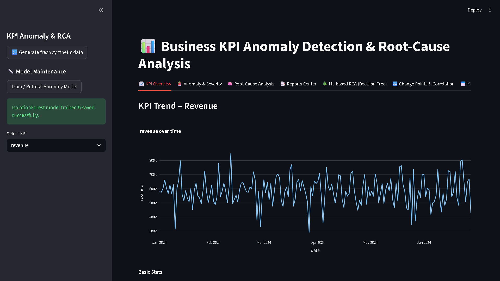
  <br>
</div>

---

### ✔ **Step 3 — Explore Enterprise Dashboard**

You can now interact with the complete 13-tab enterprise analytics platform featuring:

* KPI Monitoring & Overview
* Hybrid Anomaly Detection
* Severity Analysis & Change Points
* Root-Cause Analysis (RCA)
* Forecasting & Trend Intelligence
* Cohort / Region / Channel Analytics
* What-If Business Simulation
* AutoML Model Comparison
* Anomaly Replay Timeline
* Date Comparison Engine
* Executive Reporting & PDF Exports
* 
---

### ✔ **Step 4 — Generate Executive Reports**

Inside Reports Center tab:

Click:

**➡️ “Generate All Reports”**

Streamlit automatically:

* Creates Markdown reports
* Converts them into PDF Reports via **wkhtmltopdf**
* Bundles them into a ZIP
* Shows **inline PDF previews**
* Offers **Downloadable Exports**

No command-line steps required. Zero manual preprocessing.

---

# 🧩 End-to-End Workflow Summary 

| Step | Where       | Action                      |
|------|-------------|-----------------------------|
| 1    | Sidebar     | Generate Synthetic Data     |
| 2    | Sidebar     | Train/Refresh Anomaly Model |
| 3    | Main UI     | Explore 13 Feature Tabs     |
| 4    | Reports Tab | Generate MD + PDF + ZIP     |
| 5    | Reports Tab | Preview & Download Reports  |

---

# 🧪 **Testing**

```bash
pytest
pytest -v
pytest -q
```

---

# ⚠️ Common Issues & Fixes

## sklearn Version Warning During Testing

If you see warnings like:

```text
InconsistentVersionWarning
Trying to unpickle estimator IsolationForest...
```

it means the saved anomaly model was trained using a different version of `scikit-learn`.

### ✅ Fix

Retrain the anomaly model using:

```bash
python -m app.train_models
```

or click:

```text
Train / Refresh Anomaly Model
```

inside the Streamlit sidebar.

This regenerates the model using your current environment versions.

---

# 🔮 **Future Improvements**

* Slack/Teams alerting
* Real-time stream ingestion
* LSTM/Transformer-based anomaly models
* Causal inference workflows
* Role-based authentication
* Cloud-native deployment architecture

# 🤝 Contribution

Contributions, suggestions, and improvements are welcome.

If you found this project valuable, consider starring the repository.

---

<div align="center">

### ⚡ Enterprise KPI Intelligence for Proactive Decision-Making

</div>